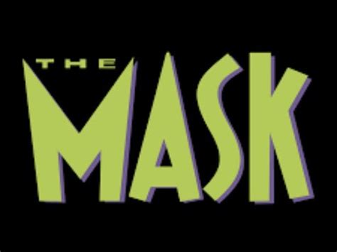
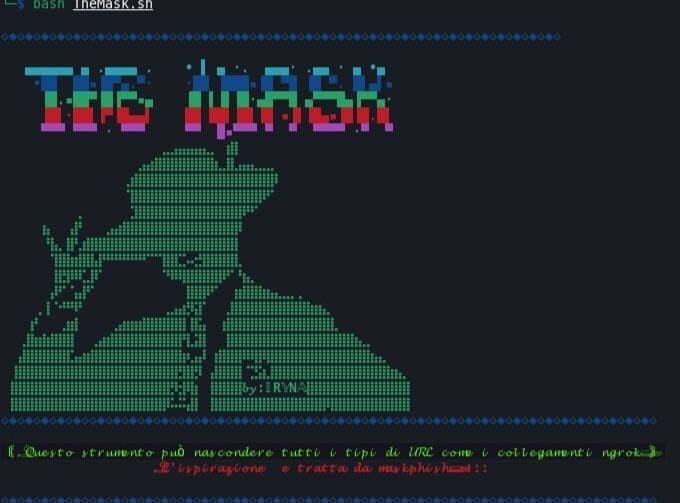

 

###  𝕋𝕙𝕖𝕄𝕒𝕤𝕜 è 𝕦𝕟𝕠 𝕤𝕥𝕣𝕦𝕞𝕖𝕟𝕥𝕠 𝕔𝕙𝕖 𝕧𝕚𝕖𝕟𝕖 𝕦𝕥𝕚𝕝𝕚𝕫𝕫𝕒𝕥𝕠 𝕡𝕖𝕣 𝕟𝕒𝕤𝕔𝕠𝕟𝕕𝕖𝕣𝕖 𝕚 𝕔𝕠𝕝𝕝𝕖𝕘𝕒𝕞𝕖𝕟𝕥𝕚 𝕡𝕙𝕚𝕤𝕙𝕚𝕟𝕘 𝕠 𝕝'𝕌ℝ𝕃 𝕕𝕚𝕖𝕥𝕣𝕠 𝕚𝕝 𝕔𝕠𝕝𝕝𝕖𝕘𝕒𝕞𝕖𝕟𝕥𝕠 𝕠𝕣𝕚𝕘𝕚𝕟𝕒𝕝𝕖,𝕡𝕦ò 𝕖𝕤𝕖𝕘𝕦𝕚𝕣𝕖 𝕒𝕥𝕥𝕒𝕔𝕔𝕙𝕚 𝕕𝕚 𝕚𝕟𝕘𝕖𝕘𝕟𝕖𝕣𝕚𝕒 𝕤𝕠𝕔𝕚𝕒𝕝𝕖 𝕒𝕝𝕝𝕖 𝕧𝕚𝕥𝕥𝕚𝕞𝕖 𝕔𝕠𝕟 𝕝𝕠 𝕤𝕔𝕠𝕡𝕠 𝕕𝕚 𝕟𝕒𝕤𝕔𝕠𝕟𝕕𝕖𝕣𝕖 𝕥𝕦𝕥𝕥𝕚 𝕚 𝕥𝕚𝕡𝕚 𝕕𝕚 "𝕌ℝ𝕃" 𝕔𝕠𝕞𝕖 𝕚 𝕔𝕠𝕝𝕝𝕖𝕘𝕒𝕞𝕖𝕟𝕥𝕚 ℕ𝕘𝕣𝕠𝕜.
---

𝕊𝕔𝕣𝕚𝕥𝕥𝕠 𝕚𝕟 𝕓𝕒𝕤𝕙 
---

###  𝕚𝕟𝕤𝕥𝕒𝕝𝕝𝕒𝕫𝕚𝕠𝕟𝕖 𝕜𝕒𝕝𝕚 𝕝𝕚𝕟𝕦𝕩:

➤ $ sudo apt update && sudo apt full-upgrade -y

    git clone https://github.com/IRYNA0308/TheMask.git

➤ $ cd TheMask

➤ $ bash TheMask.sh

---
###  𝕚𝕟𝕤𝕥𝕒𝕝𝕝𝕒𝕫𝕚𝕠𝕟𝕖 𝕋𝕖𝕣𝕞𝕦𝕩 :

➤ $ apt update

➤ $ apt upgrade -y

➤ $ pkg install git -y

➤ $ pkg install python -y

    git clone https://github.com/IRYNA0308/TheMask.git

➤ $ ls

➤ $ cd TheMask

➤ $ bash TheMask.sh

---

###  𝕃'𝕦𝕤𝕠 𝕕𝕚 𝕋𝕙𝕖𝕄𝕒𝕤𝕜 𝕡𝕖𝕣 𝕒𝕥𝕥𝕒𝕔𝕔𝕒𝕣𝕖 𝕠𝕓𝕚𝕖𝕥𝕥𝕚𝕧𝕚 𝕤𝕖𝕟𝕫𝕒 𝕚𝕝 𝕔𝕠𝕟𝕤𝕖𝕟𝕤𝕠 𝕣𝕖𝕔𝕚𝕡𝕣𝕠𝕔𝕠 è 𝕚𝕝𝕝𝕖𝕘𝕒𝕝𝕖. È 𝕣𝕖𝕤𝕡𝕠𝕟𝕤𝕒𝕓𝕚𝕝𝕚𝕥à 𝕕𝕖𝕝𝕝'𝕦𝕥𝕖𝕟𝕥𝕖 𝕗𝕚𝕟𝕒𝕝𝕖 𝕠𝕓𝕓𝕖𝕕𝕚𝕣𝕖 𝕒 𝕥𝕦𝕥𝕥𝕖 𝕝𝕖 𝕝𝕖𝕘𝕘𝕚 𝕝𝕠𝕔𝕒𝕝𝕚, 𝕤𝕥𝕒𝕥𝕒𝕝𝕚 𝕖 𝕗𝕖𝕕𝕖𝕣𝕒𝕝𝕚 𝕒𝕡𝕡𝕝𝕚𝕔𝕒𝕓𝕚𝕝𝕚. 𝔾𝕝𝕚 𝕤𝕧𝕚𝕝𝕦𝕡𝕡𝕒𝕥𝕠𝕣𝕚 𝕟𝕠𝕟 𝕤𝕚 𝕒𝕤𝕤𝕦𝕞𝕠𝕟𝕠 𝕒𝕝𝕔𝕦𝕟𝕒 𝕣𝕖𝕤𝕡𝕠𝕟𝕤𝕒𝕓𝕚𝕝𝕚𝕥à 𝕖 𝕟𝕠𝕟 𝕤𝕠𝕟𝕠 𝕣𝕖𝕤𝕡𝕠𝕟𝕤𝕒𝕓𝕚𝕝𝕚 𝕡𝕖𝕣 𝕢𝕦𝕒𝕝𝕤𝕚𝕒𝕤𝕚 𝕦𝕤𝕠 𝕚𝕞𝕡𝕣𝕠𝕡𝕣𝕚𝕠 𝕠 𝕕𝕒𝕟𝕟𝕠 𝕔𝕒𝕦𝕤𝕒𝕥𝕠 𝕕𝕒 𝕢𝕦𝕖𝕤𝕥𝕠 𝕡𝕣𝕠𝕘𝕣𝕒𝕞𝕞𝕒 𝕘𝕣𝕒𝕫𝕚𝕖.

---

 𝓡𝓮𝓪𝓭𝓶𝓮 𝓑𝔂 :::〘❀꙳𝕀R𝕐N𝔸꙳❀〙::: 

